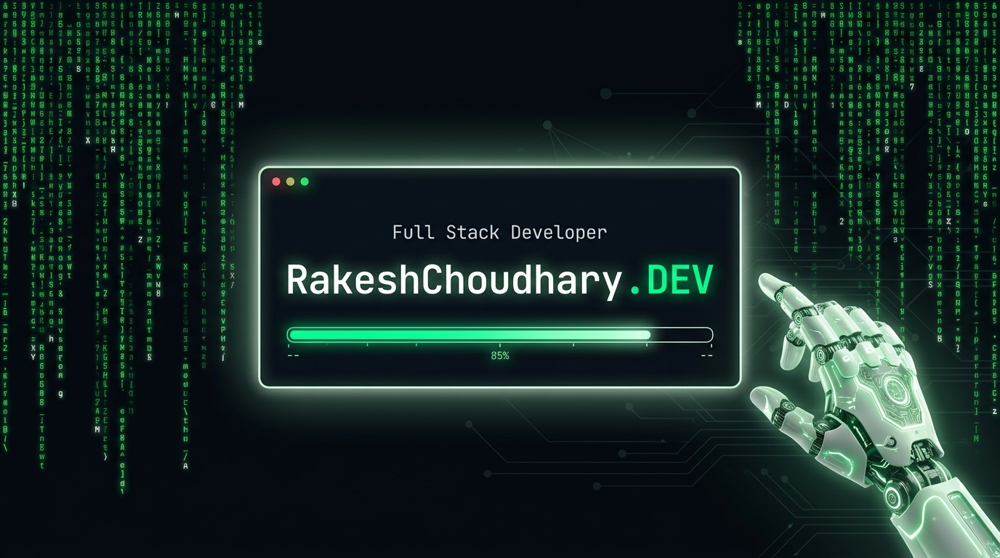

<!-- BANNER -->
<div align="center">
  
</div>

<br/>

<!-- GREETING + TYPING -->
<div align="center">

<h2>Hi, I'm Rakesh Choudhary! 👋</h2>

[](https://git.io/typing-svg)

[](https://github.com/rakesh1645)

</div>

---

<!-- 🔧 LANGUAGES AND TOOLS -->
## 🔧 Languages and Tools

<div align="center">


<br/>


</div>

---

<!-- 🌐 LET'S CONNECT -->
## 🌐 Let's Connect and Grow Together!

<div align="center">

[](https://www.linkedin.com/in/rakesh-choudhary-122146266/)
[](https://www.youtube.com/@codewithrc)
[](mailto:rakeshchoudhary941397@gmail.com)
[](https://github.com/rakesh1645)

</div>

---

<!-- ⚡ FUN FACTS -->
## ⚡ Fun Facts

- ☕ I'm fueled by **coffee and clean code**.
- 🎬 I create **coding tutorials** on my YouTube channel [**@codewithrc**](https://www.youtube.com/@codewithrc), sharing web dev tips and project walkthroughs.
- 🏏 Big **cricket fan** — I've literally been to a stadium match (check my photo below 👇).
- 🛠️ I **love building products** — from idea to deployment, I enjoy every bit of it.
- 📚 I believe **learning never stops** — currently exploring System Design, Docker & DSA.

---

<!-- 👤 ABOUT ME -->
## 👤 About Me

I'm a **passionate Full Stack MERN Developer** from 🇮🇳 **Jaipur, Rajasthan, India** with ~2 years of hands-on experience building production-grade web applications. I specialize in crafting responsive, high-performance UIs with **React.js** and **Next.js**, backed by robust **Node.js/Express.js** APIs and **MongoDB** databases.

I'm deeply focused on **SEO, SSR/SSG, JWT authentication, REST APIs**, and delivering lightning-fast, user-friendly web experiences. I'm also a **YouTube content creator** sharing my development journey at [@codewithrc](https://www.youtube.com/@codewithrc).

```yaml
Name        : Rakesh Choudhary
Role        : Full Stack MERN Developer
Experience  : ~2 Years
Location    : Jaipur, Rajasthan, India 🇮🇳
YouTube     : youtube.com/@codewithrc
LinkedIn    : linkedin.com/in/rakesh-choudhary-122146266
Email       : rakeshchoudhary941397@gmail.com
Status      : 🟢 Open to Full-Time Opportunities
```

---

<!-- 🛠️ TECH STACK -->
## 🛠️ Tech Stack

<details open>
<summary><b>🎨 Frontend</b></summary>
<br/>


</details>

<details open>
<summary><b>⚙️ Backend & Database</b></summary>
<br/>


</details>

<details open>
<summary><b>🔧 Tools & Platforms</b></summary>
<br/>


</details>

---

<!-- 🚀 FEATURED PROJECTS -->
## 🚀 Featured Projects

<details open>
<summary><b>💼 Visuti Career — Job Portal Platform</b></summary>
<br/>

| | |
|---|---|
| **About** | A full-featured job portal connecting job seekers with recruiters. Browse, filter, and apply for jobs with a seamless user experience. |
| **Stack** |     |
| **Features** | Job listings & filters · JWT auth · Resume upload · Application tracking · Admin dashboard |
| **Links** | [](YOUR_LIVE_URL) &nbsp; [](YOUR_REPO_URL) |

</details>

<details open>
<summary><b>⏱️ Stop Delay — Real-Time Alert & Scheduling App</b></summary>
<br/>

| | |
|---|---|
| **About** | A real-time notification and scheduling application designed to eliminate delays with timely alerts and status updates. |
| **Stack** |    |
| **Features** | Real-time notifications · Custom scheduling · Dashboard analytics · Email alerts · Mobile-first |
| **Links** | [](YOUR_LIVE_URL) &nbsp; [](YOUR_REPO_URL) |

</details>

<details open>
<summary><b>💍 JKJ Jewellers — Premium E-Commerce Platform</b></summary>
<br/>

| | |
|---|---|
| **About** | A premium jewellery e-commerce platform featuring elegant product showcasing, cart management, and smooth checkout. |
| **Stack** |    |
| **Features** | Product catalog · Shopping cart · Secure checkout · Order management · Admin panel · SEO optimized |
| **Links** | [](YOUR_LIVE_URL) &nbsp; [](YOUR_REPO_URL) |

</details>

<details open>
<summary><b>📰 News Affair 24 — News Aggregator Portal</b></summary>
<br/>

| | |
|---|---|
| **About** | A dynamic news aggregator portal fetching real-time news across multiple categories with a clean, reader-friendly interface. |
| **Stack** |    |
| **Features** | SSR & SSG for SEO · Category news feed · Breaking news banner · Search · Dark mode · Lighthouse-ready |
| **Links** | [](YOUR_LIVE_URL) &nbsp; [](YOUR_REPO_URL) |

</details>

<details open>
<summary><b>🙏 Roodraksh — Spiritual & Cultural Platform</b></summary>
<br/>

| | |
|---|---|
| **About** | An elegant spiritual and cultural platform for Rudraksha products with devotional UX and secure checkout. |
| **Stack** |     |
| **Features** | Product catalog · Blog section · User auth · Payment flow · SEO optimized · Fully responsive |
| **Links** | [](YOUR_LIVE_URL) &nbsp; [](YOUR_REPO_URL) |

</details>

---

<!-- 🌱 CURRENT FOCUS -->
## 🌱 Currently Learning

<div align="center">


</div>

---

<!-- 💬 DEV QUOTE -->
## 💬 Dev Quote

<div align="center">

[](https://github.com/piyushsuthar/github-readme-quotes)

</div>

---

<!-- 📸 ABOUT THE DEVELOPER -->
## 📸 The Developer Behind the Code

<div align="center">


<br/><br/>

**Rakesh Choudhary** — catching a live cricket match at the stadium! 🏏🇮🇳

*"Building great software by day, cheering for India by night."*

<br/>

[](https://www.linkedin.com/in/rakesh-choudhary-122146266/)
[](https://www.youtube.com/@codewithrc)
[](mailto:rakeshchoudhary941397@gmail.com)

</div>

---

<!-- FOOTER -->
<div align="center">


**⭐ If you find my work interesting, drop a star on my repos — it means a lot!**


*© 2025 Rakesh Choudhary · Full Stack MERN Developer · Jaipur, India*

</div>
