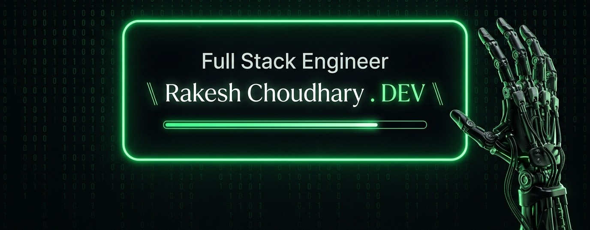

   

<h1 align="center">Hi, I'm Rakesh Choudhary!</h1>
<h3 align="center"> Full Stack Engineer (React.js / Next.js / Node.js / TypeScript)</h3>

  

  Passionate Full Stack Engineer with <b>2+ years of experience</b> crafting high-performance, scalable web applications. Specializing in modern JavaScript/TypeScript ecosystems, AI-augmented development, clean architecture, and delivering seamless user experiences across EdTech, Travel, and E-Commerce domains.

---

### 🛠️ Languages & Tools

  

  

---

### 🧑‍💻 About Me

- ⚡ **Current Role:** Full Stack Engineer at **Keasbrain Technologies**
- 🎓 **Education:** Bachelor of Computer Applications (BCA) - S.S. Jain Subodh P.G. College
- 🤖 **AI-Augmented Workflows:** Leverages **GitHub Copilot**, **OpenAI Codex**, and **Google Antigravity** to accelerate feature delivery, test scaffolding, and code quality.
- 💡 **Core Expertise:** Frontend Optimization (SSR/SSG), RESTful API Design, Micro-services & Database Architecture (MongoDB, MySQL).
- 📍 **Location:** Jaipur, Rajasthan, India
- 📫 **Reach Me:** [rakeshchoudhary941397@gmail.com](mailto:rakeshchoudhary941397@gmail.com) | [+91 9024226200](tel:+919024226200)

---

### 💼 Work Experience

#### 🔹 **Full Stack Engineer** — _Keasbrain Technologies Pvt Ltd_ `Dec 2025 – Present`

- Leading end-to-end development of **Visuti Career**, a multi-panel SaaS career-counselling platform built with React.js, Next.js, Node.js, and TypeScript.
- Architected high-performance RESTful APIs and optimized MongoDB & MySQL schemas for complex counselling workflows (seat matrices, allotment data).
- Integrated AI coding assistants (Copilot, Antigravity) into daily workflows to streamline boilerplate generation and code reviews.

#### 🔹 **Front-End Developer** — _Aladinn Digital Solutions_ `June 2024 – Nov 2025`

- Developed and maintained multiple high-performance web applications using React.js and Next.js with focus on SSR/SSG and lazy loading.
- Standardized a reusable UI component library in React, speeding up cross-functional feature delivery.
- Awarded **Employee of the Week** multiple times for React best practices and developer mentorship.

---

### 🚀 Featured Projects

| Project           | Stack                                 | Key Highlights                                                                                                                                             |
| :---------------- | :------------------------------------ | :--------------------------------------------------------------------------------------------------------------------------------------------------------- |
| **Visuti Career** | `React` `Next.js` `Node.js` `MongoDB` | SaaS Career Counselling platform with Role-Based Access Control (RBAC, 5+ roles), subscription plan-gated data access, JWT auth, and OTP verification.     |
| **Stop Delay**    | `React.js` `REST APIs` `Tailwind`     | Flight Compensation platform featuring intuitive multi-step claim submission, client validation, and interactive animated hero section.                    |
| **JKJ Jewellers** | `React` `Next.js` `SEO` `CSS3`        | E-commerce fine jewelry platform featuring rich product catalog filters, interactive image zoom, optimized cart/checkout flow, and meta SEO optimizations. |

---

### 🎓 Education

- 🎓 **Bachelor of Computer Applications (BCA)** — S.S. Jain Subodh P.G. (Autonomous) College _(2021 – 2024)_
- 🏫 **Intermediate (Class 12)** — Govt. Sr. Sec. School, RBSE _(2021 | 90%)_

---

### 🌐 Let's Connect!

  
  &nbsp;
  
  &nbsp;
  

---

### ✨ Core Strengths

- 🚀 **Full Stack System Architecture** — RESTful APIs & Scalable Backend Workflows
- ⚡ **Frontend Performance** — SSR/SSG, Code Splitting & Lazy Loading with Next.js & React
- 🗄️ **Database Design** — MongoDB Aggregation Pipelines & MySQL Schema Optimization
- 🤖 **AI-Driven Workflows** — Accelerated feature delivery using Google Antigravity & GitHub Copilot
